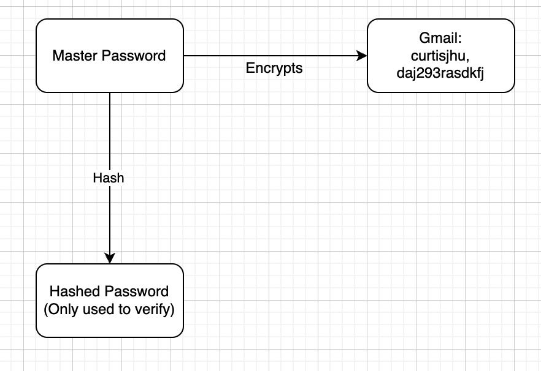

# p3man
The password manager as simple as 1, 2, 3

> Note: Please exit the terminal session. Obviously, try not to save terminal output (cmd+S). Although `ssh` should still not be able to see your terminal previous sessions.
### Keep. It. Simple. Secure. (KISS)
Visit [pypi](https://pypi.org/project/p3man/)
```
pip install p3man
```

```
Usage: p3man [OPTIONS] COMMAND [ARGS]...

Options:
  --help  Show this message and exit.

Commands:
  add     Add (username) and (password) for an account
  get     Retrieves password from account.
  list    List accounts in database (hashed).
  remove  Remove an account
  reset   Reset your master password.
  setup   Setup up your account and master password
  update  Update password for an account.
  wipe    Removes all data, all passwords from device (irreversable)
```

### Security

Your master password is hashed via python's cryptography's Scrypt.
Your accounts encrypted using the <em>original</em> password.



